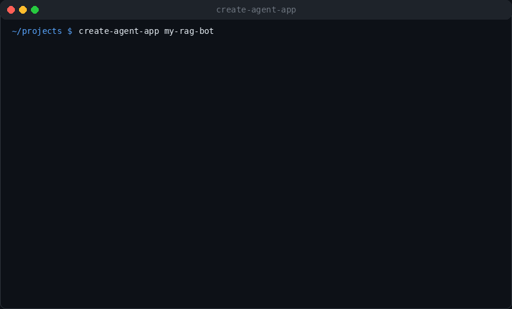

# create-agent-app

Scaffold production-ready Agentic AI projects in Python with one command.

`create-agent-app` generates opinionated, extensible project templates built around LangGraph patterns, modern provider support, API-first structure, and practical defaults for real-world teams.

## Quick Demo



## Why create-agent-app

- Production-oriented templates (not toy examples)
- Consistent project structure across agent architectures
- Interactive setup flow for provider and feature selection
- Optional FastAPI backend, streaming, tests, Docker, and observability hooks
- Ready-to-customize prompts, graph logic, tools, and config files

## Supported Templates

| Template | Best For | Architecture |
|---|---|---|
| `react_agent` | Tool-using assistants with iterative reasoning | ReAct loop with LangGraph + tool execution |
| `rag_agent` | Grounded answers from your documents | Retrieval + grading + generation pipeline with optional guards/cache |
| `multi_agent` | Coordinated specialist workflows | Supervisor graph orchestrating worker agents |
| `conversational` | Alias for conversational assistants | Delegates to `react_agent` generation |
| `hitl` | Human-in-the-loop orchestration baseline | Delegates to `multi_agent` generation |

## Supported LLM Providers

- Groq
- Gemini
- Azure OpenAI
- Ollama

Provider credentials are configured via generated `.env` files.

## Installation

```bash
pip install create-agent-app
```

For local development:

```bash
pip install -e .[dev]
```

## Usage

```bash
create-agent-app my-agent-project
```

If your shell cannot find `create-agent-app`, use:

```bash
python -m create_agent_app my-agent-project
```

Optional output directory:

```bash
create-agent-app my-agent-project --output ./workspace
```

Alias command (equivalent):

```bash
create_agent_app my-agent-project
```

The CLI prompts you to configure:

- Template type
- LLM provider
- API backend and streaming support
- Pre-installed tools
- RAG options (semantic cache and security guards)
- Optional features (Docker, tests, observability, agent description)

## What Gets Generated

Each project includes:

- A runnable `main.py` entrypoint
- Config-first setup (`config.yaml`, `.env.example`)
- Template-specific modules (`agent/`, `rag/`, `agents/`, `tools/`, etc.)
- Optional `api/` routes and schemas
- Optional `tests/`
- Optional Docker artifacts

The generator also initializes git and creates a `data/` directory scaffold.

## Feature Flags (Template Rendering)

The generator conditionally includes files based on selected options:

- `include_api`: includes or skips `api/`
- `include_tests`: includes or skips `tests/`
- `include_docker`: includes or skips Docker artifacts
- `include_guards` (RAG): includes or skips `security/`
- `include_semantic_cache` (RAG): includes or skips semantic cache template

## Example Developer Workflow

```bash
create-agent-app customer-support-agent
cd customer-support-agent
python -m venv .venv
source .venv/bin/activate  # Windows: .venv\Scripts\activate
pip install -r requirements.txt
cp .env.example .env
# Add provider credentials
python main.py
```

## Project Quality Notes

- Templates are generated from Jinja files under `create_agent_app/templates/`
- Shared and template-specific rendering are centralized in `create_agent_app/generator.py`
- Generation summary is displayed in rich tables for clarity
- Templates are structured for straightforward extension, not lock-in

## Development

```bash
pip install -e .[dev]
python -m build
python -m twine check dist/*
```

## Troubleshooting (Windows)

If you see:

`create-agent-app : The term 'create-agent-app' is not recognized ...`

then the package is usually installed, but your Python Scripts directory is not on `PATH`.

Check install location:

```powershell
py -m pip show create-agent-app
py -m site --user-base
```

Typical scripts path to add to `PATH`:

`%APPDATA%\Python\Python3x\Scripts`

After updating `PATH`, restart PowerShell and run:

```powershell
create-agent-app --help
```

Fallback that always works when package is installed:

```powershell
py -m create_agent_app --help
```

## Publishing to PyPI

If a version already exists on PyPI, bump `project.version` in `pyproject.toml` before upload.

```bash
python -m build
twine upload dist/*
```

Optional:

```bash
twine upload --skip-existing dist/*
```

## Contributing

1. Fork the repository.
2. Create a branch for your change.
3. Validate generated templates locally.
4. Submit a pull request with a clear summary and sample output.

## License

MIT
