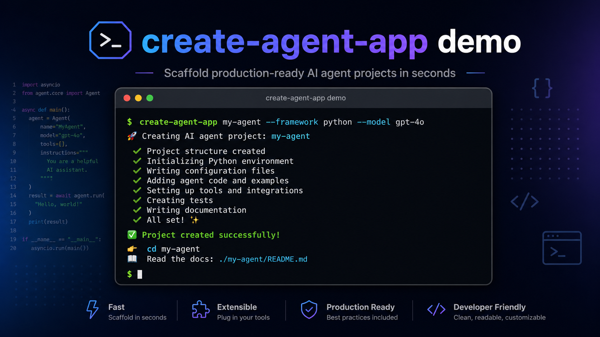

# create-agent-app

Scaffold production-ready Agentic AI Python projects in seconds.

## Quick Demo



## Install

```bash
pip install create-agent-app
```

For local development:

```bash
pip install -e .
```

## Usage

```bash
create-agent-app my-agent-project
```

The CLI prompts for:
- template (`single_agent`, `multi_agent`, `rag_agent`)
- LLM provider (Groq, Gemini, Azure OpenAI, Ollama)
- model name (provider-specific)

Then it generates a complete project folder and prints next steps.

## Template Comparison

| Template | Best For | Generated Architecture |
|---|---|---|
| `single_agent` | One assistant with tool-calling | LangGraph single-node loop + ToolNode |
| `multi_agent` | Staged workflows (research + writing) | Supervisor + worker agents (researcher, writer) |
| `rag_agent` | Document-grounded answers | ChromaDB + local embeddings + retriever tool + agent |

## LLM Provider Setup

Set values in the generated `.env` file:

| Provider | Required Keys |
|---|---|
| Groq | `GROQ_API_KEY`, `LLM_PROVIDER=groq`, `MODEL_NAME=...` |
| Gemini | `GEMINI_API_KEY`, `LLM_PROVIDER=gemini`, `MODEL_NAME=...` |
| Azure OpenAI | `AZURE_OPENAI_API_KEY`, `AZURE_OPENAI_ENDPOINT`, optional `AZURE_OPENAI_DEPLOYMENT`, `LLM_PROVIDER=azure`, `MODEL_NAME=...` |
| Ollama | `OLLAMA_BASE_URL` (default `http://localhost:11434`), `LLM_PROVIDER=ollama`, `MODEL_NAME=...` |

## Development

```bash
pip install -e .[dev]
python -m build
twine check dist/*
```

## Contributing

1. Fork the repository.
2. Create a feature branch.
3. Run local checks and verify generated templates.
4. Open a pull request with a clear summary and sample scaffold output.
